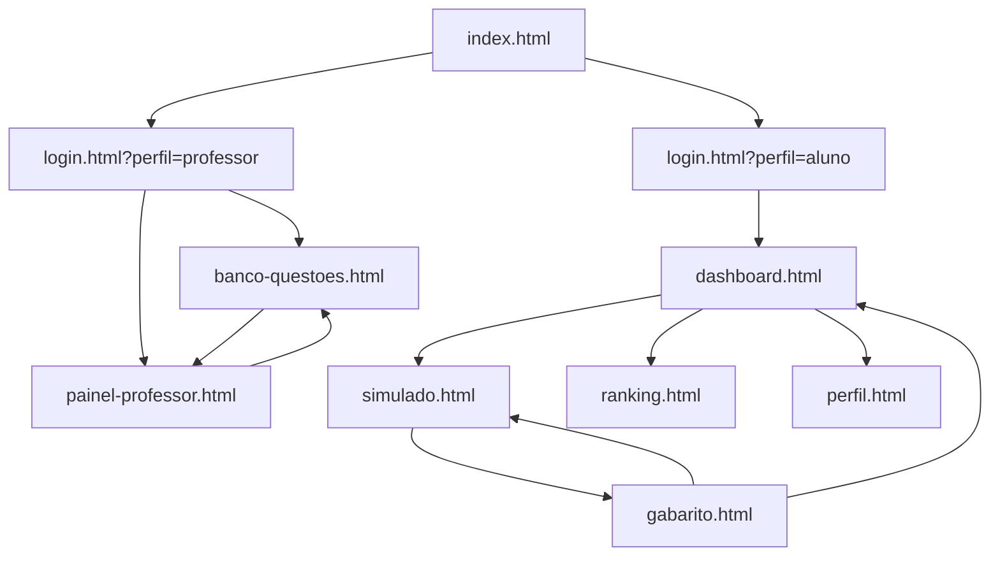

# SAEBTrack

Plataforma web para preparação ao **SAEB** (Sistema de Avaliação da Educação Básica), voltada à educação pública do Piauí. O projeto oferece experiências distintas para **alunos** (prática gamificada com XP e descritores) e **professores** (acompanhamento de turmas e banco de questões).

> **Status:** protótipo front-end estático (HTML, CSS e JavaScript vanilla). Não há backend, autenticação real nem persistência de dados — os fluxos simulam o comportamento da aplicação final.

---

## Sumário

- [Funcionalidades](#funcionalidades)
- [Tecnologias](#tecnologias)
- [Como executar](#como-executar)
- [Fluxos de navegação](#fluxos-de-navegação)
- [Estrutura do projeto](#estrutura-do-projeto)
- [Identidade visual](#identidade-visual)
- [Ícones](#ícones)
- [Licença](#licença)

---

## Funcionalidades

### Aluno

| Tela | Descrição |
|------|-----------|
| **Seleção de perfil** (`index.html`) | Entrada com escolha entre aluno e professor |
| **Login / Cadastro** | Formulários de autenticação (protótipo; redireciona sem validar API) |
| **Dashboard** | Banner de nível e XP, botão para iniciar simulado, conquistas recentes e mapa de habilidades por descritor (LP / MAT) |
| **Simulado** | 5 questões com timer, barra de progresso, feedback imediato (correto/errado) e avanço entre questões |
| **Gabarito** | Desempenho (acertos, precisão, XP), revisão das questões e ações para novo simulado ou voltar ao dashboard |
| **Ranking** | Ranking semanal com pódio (top 3) e lista; alternância entre “Minha Turma” e “Toda a Escola” |
| **Perfil** | Dados do aluno, estatísticas e grid de conquistas (desbloqueadas e bloqueadas) |

### Professor

| Tela | Descrição |
|------|-----------|
| **Painel de Turmas** | Métricas da turma, alertas pedagógicos por descritor crítico e matriz de habilidades (alunos × descritores) |
| **Banco de Questões** | Formulário para criar questões (disciplina, dificuldade, descritor, enunciado, alternativas) e listagem das questões cadastradas |

---

## Tecnologias

- **HTML5** — páginas estáticas
- **CSS3** — variáveis CSS, layout com Flexbox e Grid, media queries para menu mobile
- **JavaScript (ES6+)** — interatividade por página, sem frameworks
- **[Lucide Icons](https://lucide.dev)** — biblioteca única de ícones (via CDN)
- **[Google Fonts — Inter](https://fonts.google.com/specimen/Inter)** — tipografia principal

Não há bundler, npm nem dependências locais obrigatórias além de um servidor HTTP simples para desenvolvimento.

---

## Como executar

1. Clone o repositório e entre na pasta do projeto:

```bash
cd SAEBTrack
```

2. Sirva os arquivos com um servidor local (evita problemas de CORS e caminhos relativos):

```bash
# Python 3
python -m http.server 8080

# Node.js (npx)
npx serve .
```

3. Abra no navegador:

```
http://localhost:8080/index.html
```

4. **Atalhos de teste**
   - Aluno: `index.html` → Sou Aluno → Login (qualquer e-mail/senha) → `dashboard.html`
   - Professor: `index.html` → Sou Professor → Login → `banco-questoes.html` ou `painel-professor.html`
   - Simulado completo: Dashboard → Iniciar simulado → ao terminar, redireciona para `gabarito.html`

> Coloque o arquivo `images/logo.png` na pasta `images/` se ainda não existir no seu ambiente (referenciado em todas as navbars).

---

## Fluxos de navegação



### Navbar do aluno

Links: **Dashboard** · **Simulado** · **Ranking** · **Perfil**  
Item ativo em verde (`--color-green`). Menu responsivo com drawer em telas menores.

### Navbar do professor

Links: **Painel de Turmas** · **Banco de Questões**  
Item ativo em amarelo (`--color-yellow`). Botão de logout com ícone Lucide.

---

## Estrutura do projeto

```
SAEBTrack/
├── index.html              # Seleção de perfil (aluno / professor)
├── login.html              # Login (query ?perfil=aluno|professor)
├── cadastro.html           # Cadastro de nova conta
├── dashboard.html          # Dashboard do aluno
├── simulado.html           # Simulado com questões
├── gabarito.html           # Resultado e revisão do simulado
├── ranking.html            # Ranking semanal
├── perfil.html             # Perfil e conquistas do aluno
├── painel-professor.html   # Painel do professor
├── banco-questoes.html     # Banco de questões do professor
├── css/
│   ├── global.css          # Design system, navbar, utilitários
│   ├── login.css           # Seleção de perfil, login e cadastro
│   ├── dashboard.css       # Dashboard e mapa de habilidades
│   ├── simulado.css        # Tela do simulado
│   ├── gabarito.css        # Gabarito e revisão
│   ├── ranking.css         # Ranking e pódio
│   ├── perfil.css          # Perfil do aluno
│   ├── professor.css       # Painel do professor
│   └── banco-questoes.css  # Banco de questões
├── js/
│   ├── global.js           # Lucide, menu mobile, utilitários
│   ├── dashboard.js        # Mapa de descritores (LP/MAT)
│   ├── simulado.js         # Questões, timer e navegação
│   ├── gabarito.js         # Revisão e métricas de desempenho
│   ├── ranking.js          # Toggle turma / escola
│   ├── perfil.js           # Grid de conquistas
│   ├── professor.js        # Matriz de habilidades da turma
│   └── banco-questoes.js   # CRUD protótipo de questões
├── images/
│   └── logo.png            # Logo SAEBTrack
├── .cursor/rules/
│   └── lucide-icons.mdc    # Regra: usar apenas Lucide para ícones
├── LICENSE
└── README.md
```

Cada tela carrega `css/global.css` + seu CSS específico, e `js/global.js` + seu JS quando há lógica na página.

---

## Identidade visual

Variáveis definidas em `css/global.css`:

| Token | Valor | Uso |
|-------|-------|-----|
| `--bg-primary` | `#0b0f1a` | Fundo geral |
| `--bg-card` | `#131929` | Cards e painéis |
| `--bg-card-hover` | `#1a2035` | Hover em cards |
| `--color-green` | `#3ddc84` | Aluno, sucesso, domínio |
| `--color-yellow` | `#f5a623` | Professor, destaques |
| `--color-red` | `#e74c3c` | Erros, crítico |
| `--color-gray` | `#4a5568` | Desabilitado, placeholders |
| `--color-purple` | `#9b59b6` | Nível Desafiador |
| `--text-primary` | `#ffffff` | Texto principal |
| `--text-secondary` | `#8892a4` | Texto secundário |

**Inputs:** fundo `#0b1120`, sem borda, `border-radius: 8px`.  
**Botão primário:** fundo verde, texto `#0b0f1a`, negrito.  
**Botão secundário:** transparente, borda `#4a5568`.

---

## Ícones

O projeto usa **exclusivamente [Lucide](https://lucide.dev)** para ícones de interface (sem emojis nem outras bibliotecas). Padrão no HTML:

```html
<script src="https://unpkg.com/lucide@latest/dist/umd/lucide.min.js"></script>
<script src="js/global.js"></script>

<i data-lucide="nome-do-icone" class="icon icon-sm" aria-hidden="true"></i>
```

Conteúdo gerado via `innerHTML` deve chamar `window.initLucideIcons()` após atualizar o DOM. Detalhes em `.cursor/rules/lucide-icons.mdc`.

---

## Limitações do protótipo

- Login e cadastro não validam credenciais nem chamam API
- Dados de alunos, ranking, questões e matriz são **hardcoded** nos arquivos `.js`
- Respostas do simulado não são salvas; o gabarito exibe placar fixo (0/5) no protótipo atual
- Não há testes automatizados nem pipeline de build

Essas limitações são esperadas nesta fase de **desenvolvimento do MVP**.

---

## Licença

Este projeto está sob a licença **MIT**. Veja o arquivo [LICENSE](LICENSE) para mais detalhes.

---

**SAEBTrack** — *Do Piauí para o Mundo* · Educação Pública do Piauí · Desenvolvido pela equipe SAEBTrack - CETI Pedro Coelho de Resende
